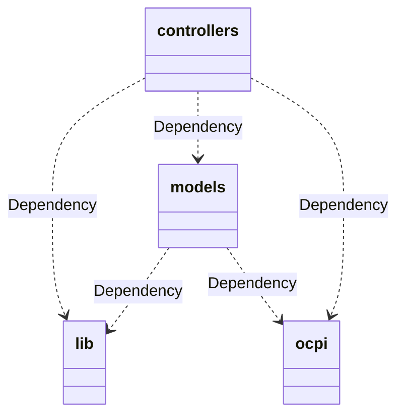
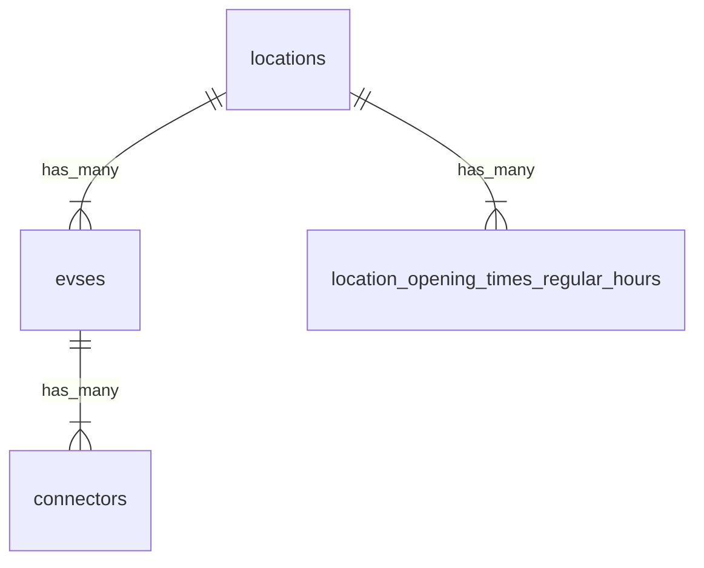

### 初期設定
```
go install golang.org/dl/go1.21.6@latest 
go1.21.6 download
go1.21.6 mod init github.com/diskymg/go-challenge/diskymg
go1.21.6 mod tidy
```

### OpenAPIスキーマファイルの検討
OCPI2.2のOpenAPIスキーマファイルを見つけたが、当然READMEの要件に不要なものが多い。  
https://github.com/openchargemap/ocm-docs/blob/master/Model/schema/ocpi-2.2-openapi-spec.yaml  
またそのyamlでは regular_hours, exceptional_openings, exceptional_closings が配列になっていないが、  
仕様書PDFを見ると配列なので、間違っていそう。  

https://www.npmjs.com/package/@plugoinc/ocpi-openapi-yaml?activeTab=code  
は正確そうだが、 opening_times 直下が配列になっていて間違っていそうな気がする。  
後者をベースにし自前で用意する。  

### エラーコード
仕様書PDFのステータスコードに関する説明を見たところ、  
おそらくcontrollerに達した時点でHTTPステータスとしてエラーを返してはいけない。  
よって実装としては、ステータスはレスポンスボディのみ考慮しstatus_codeには、  
仕様通り成功なら1000、失敗なら3000とする。その他記載されているのコードは適切感が分からないためひとまず考慮しない。  

### date_from, date_to での絞り
date_from は閾値を含む、date_to は閾値を含まない、はず。

### ソート
仕様書PDFのP18の「Paginated Response」を見ると、
「最も古いもの (last_updated フィールドではなく作成日による) を最初に返すベストプラクティス。」
のようなことが英語で書かれているようなので、created_atでORDER BYする。

### package構成検討
MVCに当てはめて考えると、  
Model: package models: gormの構造体やそれに関する処理  
Controller: package controllers: 自動生成した ServerInterface を実装する。  
package lib と 自動生成した ocpi はModelとViewの中間のような風に捉える。  
gormの構造体からopenapi構造体に変換する処理は package models に書くことにする。  
（modelsが膨らむ場合別packageにした方が良いかもしれない）



### OpenAPIのツール選定
OpenAPIスキーマファイルからlocationsに必要な実装を生成したい。  

Ginが使えるOpenAPIスキーマファイルから自動生成するライブラリは openapi-generator と oapi-codegen などがあるが、  
軽く調べた所 oapi-codegen の方が細かい指定ができそうなのでそちらを使うことにした。  

### oapi-codegenで自動生成する
```
go1.21.6 install github.com/deepmap/oapi-codegen/v2/cmd/oapi-codegen@latest
go1.21.6 mod tidy
```

読みやすいように種類別に自動生成する。
```
oapi-codegen -generate gin   -package ocpi ocpi/openapi-spec.yaml > ocpi/gin.gen.go
oapi-codegen -generate types -package ocpi ocpi/openapi-spec.yaml > ocpi/types.gen.go
oapi-codegen -generate spec  -package ocpi ocpi/openapi-spec.yaml > ocpi/spec.gen.go
```

### テーブル検討
テーブル構造に関して細かい指定はないため、READMEで指定された項目のみテーブルに持たせることにする。  
仕様書PDFでは locations は evses を複数持ち evses は connectors を複数持つため、素直にhas_manyな構造にする。  
opening_timesはObjectで、opening_times.twentyfourseven は boolean なので locations に持たせる。  
opening_times.regular_hours は配列で中身がObjectのようなものなので、  
jsonカラムで持たせるか別テーブルにするか悩んだが、jsonカラムは乱用すると良くないので別テーブルにする。  



仕様書PDFを見たところevseのuidはdatabase IDでも良いので、gormのデフォルト主キーのidをAPI側として利用する。  

LastUpdated は UpdatedAt ではなく、別途カラムを用意する。
理由としては、PDFの「8.2.2.2. PUT Method」を読むと、PUT時に Evse や Connector のみを渡して更新できるらしく、
その場合親オブジェクト(Connector なら Evse と Location)の LastUpdated を更新するらしい。
UpdatedAt を LastUpdated として利用する場合、例えば Connector の UpdatedAt が更新された場合、親である Evse と Location の UpdatedAt を手動で更新する必要がある。
それは UpdatedAt の機能を潰している気もするので、別途カラムを用意する。

# テストコード
実際にURLを叩いてレスポンスを確認するテストを優先的に書く。package controllers に書く。

テストDBをローカル環境に用意して、標準のやり方で実行する。

```
% psql -U postgres
% CREATE DATABASE ocpi_test;
```


### 確認方法検討
テストデータの作成方法は Seed() で適当に入れることにする。  

動作確認の方法についてはswagger-uiが便利だと判断し、  
ローカルならdockerと組み合わせれば上手く起動できると思うため docker compose を使用する  

(oapi-codegen のgenerate対象に client というのがありそれを使えば確認することができそうだが、
おそらくテストやSDKとして外部のopenapiを叩くもの、と判断したので使用しない。)

### 起動/確認
```
docker compose up --build
```
http://localhost:8001/ にアクセスしてswagger-uiを立ち上げる

DBクラウアントでアクセスすれば中身をいじることは可能  
```
host localhost
port 5432
database: ocpi
user: postgres
password: koikeya
```

データをSeed直後状態に戻したい場合は、  
```
docker compose down --volumes
```
してデータを消してから再起動すればSeed直後状態に戻る  
